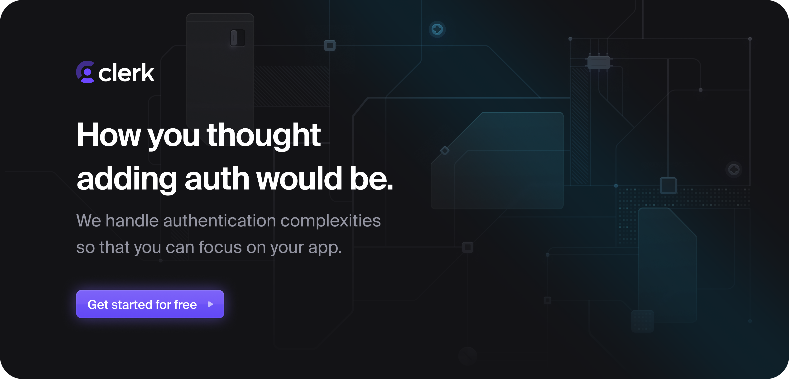

   
  
  <h3 align="center">Auth.js</h3>
  
Authentication for the Web.

  
Open Source. Full Stack. Own Your Data.

  

    
    
    
    
  

Auth.js is a set of open-source packages that are built on Web Standard APIs for authentication in modern applications with any framework on any platform in any JS runtime.

See [authjs.dev](https://authjs.dev) for our framework-specific libraries, or check out [next-auth.js.org](https://next-auth.js.org) for `next-auth` (Next.js).

## Features

### Flexible and easy to use

- Designed to work with any OAuth service, it supports 2.0+, OIDC
- Built-in support for [many popular sign-in services](https://github.com/nextauthjs/next-auth/tree/main/packages/core/src/providers)
- Email/Passwordless authentication
- Bring Your Database - or none! - stateless authentication with any backend (Active Directory, LDAP, etc.)
- Runtime-agnostic, runs anywhere! (Vercel Edge Functions, Node.js, Serverless, etc.)

### Own your data

Auth.js can be used with or without a database.

- An open-source solution that allows you to keep control of your data
- Built-in support for [MySQL, MariaDB, Postgres, Microsoft SQL Server, MongoDB, SQLite, etc.](https://adapters.authjs.dev)
- Works great with databases from popular hosting providers

### Secure by default

- Promotes the use of passwordless sign-in mechanisms
- Designed to be secure by default and encourage best practices for safeguarding user data
- Uses Cross-Site Request Forgery (CSRF) Tokens on POST routes (sign in, sign out)
- Default cookie policy aims for the most restrictive policy appropriate for each cookie
- When JSON Web Tokens are used, they are encrypted by default (JWE) with A256GCM
- Features tab/window syncing and session polling to support short-lived sessions
- Attempts to implement the latest guidance published by [Open Web Application Security Project](https://owasp.org)

Advanced configuration allows you to define your routines to handle controlling what accounts are allowed to sign in, for encoding and decoding JSON Web Tokens and to set custom cookie security policies and session properties, so you can control who can sign in and how often sessions have to be re-validated.

### TypeScript

Auth.js libraries are written with type safety in mind. [Check out the docs](https://authjs.dev/getting-started/typescript) for more information.

## Security

If you think you have found a vulnerability (or are not sure) in Auth.js or any of the related packages (i.e. Adapters), we ask you to read our [Security Policy](https://authjs.dev/security) to reach out responsibly. Please do not open Pull Requests/Issues/Discussions before consulting with us.

## Acknowledgments

[Auth.js is made possible thanks to all of its contributors.](https://authjs.dev/contributors)

### Sponsors

<a href="https://clerk.com?utm_source=sponsorship&utm_medium=github&utm_campaign=authjs&utm_content=callout">
  <picture>
    <source media="(prefers-color-scheme: dark)" srcset="docs/static/img/clerk-readme-light.png">
    <source media="(prefers-color-scheme: light)" srcset="docs/static/img/clerk-readme-dark.png">
    
  </picture>
</a>
  

We have an [OpenCollective](https://opencollective.com/nextauth) for companies and individuals looking to contribute financially to the project!

<!--sponsors start-->
<table>
  <tbody>
    <tr>
      <td align="center" valign="top">
         
        
Vercel
 
        🥉 Bronze Financial Sponsor   ☁️ Infrastructure Support
      </td>
      <td align="center" valign="top">
         
        
Prisma
 
        🥉 Bronze Financial Sponsor
      </td>
      <td align="center" valign="top">
         
        
Clerk
 
        🥉 Bronze Financial Sponsor
      </td>
      <td align="center" valign="top">
         
        
Lowdefy
 
        🥉 Bronze Financial Sponsor
      </td>
      <td align="center" valign="top">
         
        
WorkOS
 
        🥉 Bronze Financial Sponsor
      </td>
      <td align="center" valign="top">
         
        
Descope
 
        🥉 Bronze Financial Sponsor
      </td>
      <td align="center" valign="top">
         
        
Checkly
 
        ☁️ Infrastructure Support
      </td>
      <td align="center" valign="top">
         
        
superblog
 
        ☁️ Infrastructure Support
      </td>
    </tr><tr></tr>
  </tbody>
</table>
 
<!--sponsors end-->

## Contributing

We're open to all community contributions! If you'd like to contribute in any way, please first read
our [Contributing Guide](https://github.com/nextauthjs/.github/blob/main/CONTRIBUTING.md).

## License

ISC
