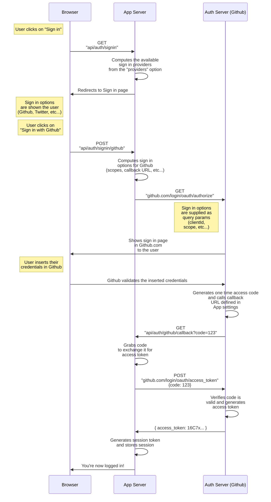

Authentication Providers in **Auth.js** are OAuth definitions that allow your users to sign in with their favorite preexisting logins. You can use any of our many predefined providers, or write your own custom OAuth configuration.

- [Using a built-in OAuth Provider](#built-in-providers) (e.g Github, Twitter, Google, etc...)
- [Using a custom OAuth Provider](#using-a-custom-provider)

:::note
Auth.js is designed to work with any OAuth service, it supports **OAuth 1.0**, **1.0A**, **2.0** and **OpenID Connect** and has built-in support for most popular sign-in services.
:::

Without going into too much detail, the OAuth flow generally has 6 parts:

1. The application requests authorization to access service resources from the user
2. If the user authorized the request, the application receives an authorization grant
3. The application requests an access token from the authorization server (API) by presenting authentication of its own identity, and the authorization grant
4. If the application identity is authenticated and the authorization grant is valid, the authorization server (API) issues an access token to the application. Authorization is complete.
5. The application requests the resource from the resource server (API) and presents the access token for authentication
6. If the access token is valid, the resource server (API) serves the resource to the application

For more details, check out Aaron Parecki's blog post [OAuth2 Simplified](https://aaronparecki.com/oauth-2-simplified/) or Postman's blog post [OAuth 2.0: Implicit Flow is Dead, Try PKCE Instead](https://blog.postman.com/pkce-oauth-how-to/).
