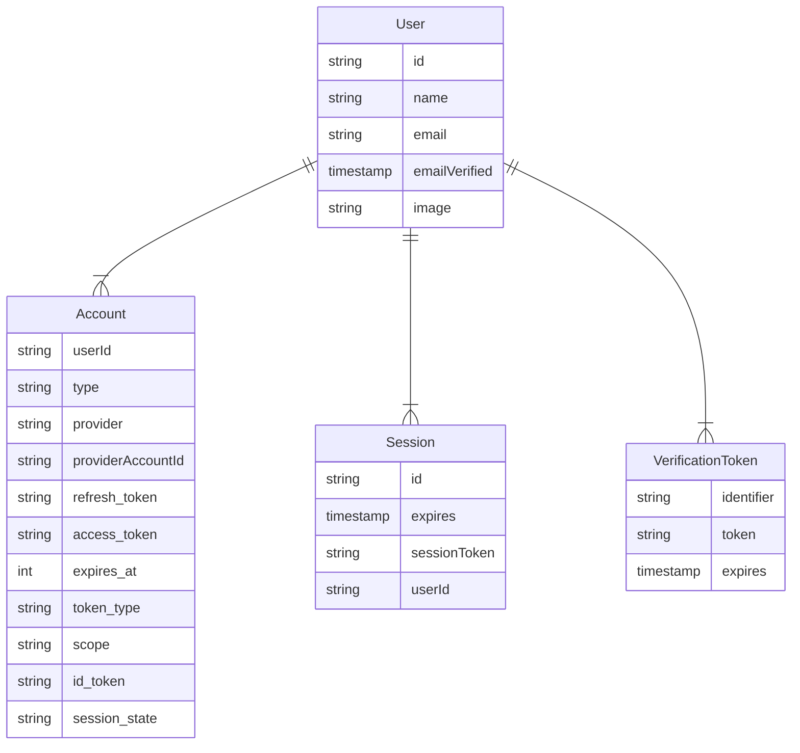

import manifest from "../../manifest.mjs"

An **Adapter** in Auth.js connects your application to whatever database or backend system you want to use to store data for users, their accounts, sessions, etc. Adapters are optional, unless you need to persist user information in your own database, or you want to implement certain flows. For example, the [Email Provider](/getting-started/providers/email-tutorial) requires an adapter to be able to save [Verification Tokens](#verification-token).

On how to use Auth.js with other databases, check out the [creating a database adapter](/guides/adapters/creating-a-database-adapter) guide.

## Official adapters

Below you can see a list of official adapters that are distributed as their own packages under the `@auth/{name}-adapter` namespace. Their source code is available in their various adapters package directories at [`nextauthjs/next-auth`](https://github.com/nextauthjs/next-auth/tree/main/packages)

:::info
If you don't find an adapter for the database or service you use, you can always create one yourself (and optionally open a PR so anyone can make use of it). Have a look at our guide on [how to create a database adapter](/guides/adapters/creating-a-database-adapter).
:::

<div class="card-list">
  {manifest.adapters.map(({ id, name, img }) => (
    <a href={`/reference/adapter/${id}`} class="card">
      
      <h4 class="card__title">{name} Adapter</h4>
    </a>
  ))}
</div>

---

## Models

Auth.js can be used with any database. Models tell you what structures Auth.js expects from your database. Models will vary slightly depending on which adapter you use, but in general, will have a similar structure to the graph below. Each model can be extended with additional fields.

Below is the most common structure of the models, but note that you can implement a much simpler structure, based on your use case. More details in the [creating a database adapter](/guides/adapters/creating-a-database-adapter) guide.



:::note
Auth.js libraries use `camelCase` for its database rows while respecting the conventional `snake_case` formatting for OAuth-related values. If the mixed casing is an issue for you, most adapters have a dedicated documentation section on how to force a casing convention.
:::

---

### User

The User model is for information such as the user's name and email address.

Email address is optional, but if one is specified for a User, then it must be unique.

:::note
If a user first signs in with an OAuth provider, then their email address is automatically populated using the one from their OAuth profile if the OAuth provider returns one.

This provides a way to contact users and for users to maintain access to their account and sign in using email in the event they are unable to sign in with the OAuth provider in the future (if the [Email Provider](/reference/core/providers/email) is configured).
:::

User creation in the database is automatic and happens when the user is logging in for the first time with a provider.
If the first sign-in is via the [OAuth Provider](/guides/providers/custom-provider), the default data saved is `id`, `name`, `email` and `image`. You can add more profile data by returning extra fields in your [OAuth provider](/guides/providers/custom-provider)'s [`profile()`](/reference/core/providers#profile) callback.

If the first sign-in is via the [Email Provider](/reference/core/providers/email), then the saved user will have `id`, `email`, `emailVerified`, where `emailVerified` is the timestamp of when the user was created.

### Account

The Account model is for information about OAuth accounts associated with a User

A single User can have multiple Accounts, but each Account can only have one User.

Account creation in the database is automatic and happens when the user is logging in for the first time with a provider, or the [`Adapter.linkAccount`](/reference/core/adapters#linkaccount) method is invoked. The default data saved is `access_token`, `expires_at`, `refresh_token`, `id_token`, `token_type`, `scope` and `session_state`. You can save other fields or remove the ones you don't need by returning them in the [OAuth provider](/guides/providers/custom-provider)'s [`account()`](/reference/core/providers#account) callback.

Linking Accounts to Users happen automatically, only when they have the same e-mail address, and the user is currently signed in. Check the [FAQ](/concepts/faq#security) for more information on why this is a requirement.

:::tip
You can manually unlink accounts if your adapter implements the `unlinkAccount` method. Make sure to take all the necessary security steps to avoid data loss.
:::

### Session

:::info
Even if you are using a database, you can still use JWT for session handling for fast access, in which case, this model can be opted out in your database. Learn more about [`session strategies`](/concepts/session-strategies) and their trade-offs.
:::

The Session model is used for database sessions and it can store arbitrary data for an active user session. A single User can have multiple Sessions, each Session can only have one User.

When a Session is read, its `expires` field is checked to see if the session is still valid. If it has expired, the session is deleted from the database.

:::tip
You can also do this clean-up periodically in the background to avoid our extra delete call to the database during an active session retrieval. This might result in a slight performance increase in a few cases.
:::

### Verification Token

The Verification Token model is used to store tokens for passwordless sign in.

A single User can have multiple open Verification Tokens (e.g. to sign in to different devices).

It has been designed to be extendable for other verification purposes in the future (e.g. 2FA / magic codes, etc.).

Auth.js makes sure that every token is usable only once, and by default has a short (1 day, can be configured by [`maxAge`](/guides/providers/email)) lifetime. If your user did not manage to finish the sign-in flow in time, they will have to start the sign-in process again.

:::tip
Due to users forgetting or failing at the sign-in flow, you might end up with unwanted rows in your database, that you might have to periodically clean up to avoid filling the database up with unnecessary data.
:::

## TypeScript

Official adapters are all written in TypeScript. If you're writing your own custom Adapter, you can take advantage of the types that comes with `@auth/core` to make sure your implementation conforms to what's expected:

```ts
import type { Adapter } from "@auth/core/adapters"

function MyAdapter(): Adapter {
  return {
    // your adapter methods here
  }
}
```

When writing your own custom Adapter in plain JavaScript, note that you can use **JSDoc** to get helpful editor hints and auto-completion like so:

```js
/** @return { import("@auth/core/adapters").Adapter } */
function MyAdapter() {
  return {
    // your adapter methods here
  }
}
```

:::note
This will work in code editors with a strong TypeScript integration like VSCode or WebStorm. It might not work if you're using more lightweight editors like VIM or Atom.
:::

For more information, check out the [`@auth/core/adapters` API Reference](/reference/core/adapters).
