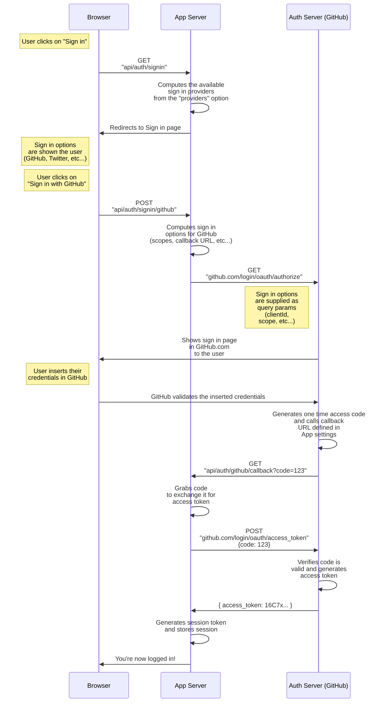

import { Callout } from "nextra/components"
import { Screenshot } from "@/components/Screenshot"

# OAuth

<Callout>
  Auth.js is designed to work with any OAuth service, it supports **OAuth 2.0**
  and **OpenID Connect** and has built-in support for most popular sign-in
  services.
</Callout>

Authentication Providers in **Auth.js** are predefined [OAuth](https://oauth.net/2/) configurations that allow your users to sign in with pre-existing logins at their favorite services. You can use any of our predefined providers, or write your own custom OAuth configuration. For customizing or writing your own OAuth provider, see our [configuring OAuth providers](/guides/configuring-oauth-providers) guide.

At a high level, the OAuth **Authorization Code** flow we support generally has 6 parts:

1. The application requests authorization to access service resources from the user
2. If the user authorized the request, the application receives an authorization grant
3. The application requests an access token from the authorization server (API) by presenting authentication of its own identity, and the authorization grant
4. If the application identity is authenticated and the authorization grant is valid, the authorization server (API) issues an access token to the application. Authorization is complete.
5. The application requests the resource from the resource server (API) and presents the access token for authentication
6. If the access token is valid, the resource server (API) serves the resource to the application

## Diagrams

Below are two diagrams visually illustrating the same basic flow as described above, the OAuth Authorization Code flow. First is a sequence diagram.

Next is a swim lane diagram which comes from a great article, [Setting up OAuth with Auth.js and SvelteKit](https://mainmatter.com/blog/2023/11/23/setting-up-oauth-with-auth-js-and-sveltekit/) by [Andrey Mikhaylov](https://lolma.us) of [mainmatter.com](https://mainmatter.com).

import OAuthDiagram from "../../public/img/concepts/oauth-diagram.webp"

<Screenshot src={OAuthDiagram} alt="OAuth Flow Diagram" />

## Further Reading

To learn more, check out the following blog posts:

- Aaron Parecki's blog post [OAuth2 Simplified](https://aaronparecki.com/oauth-2-simplified/)
- Postman's blog post [OAuth 2.0: Implicit Flow is Dead, Try PKCE Instead](https://blog.postman.com/pkce-oauth-how-to/)
- Setting up OAuth with Auth.js and SvelteKit [blog post](https://mainmatter.com/blog/2023/11/23/setting-up-oauth-with-auth-js-and-sveltekit/)
