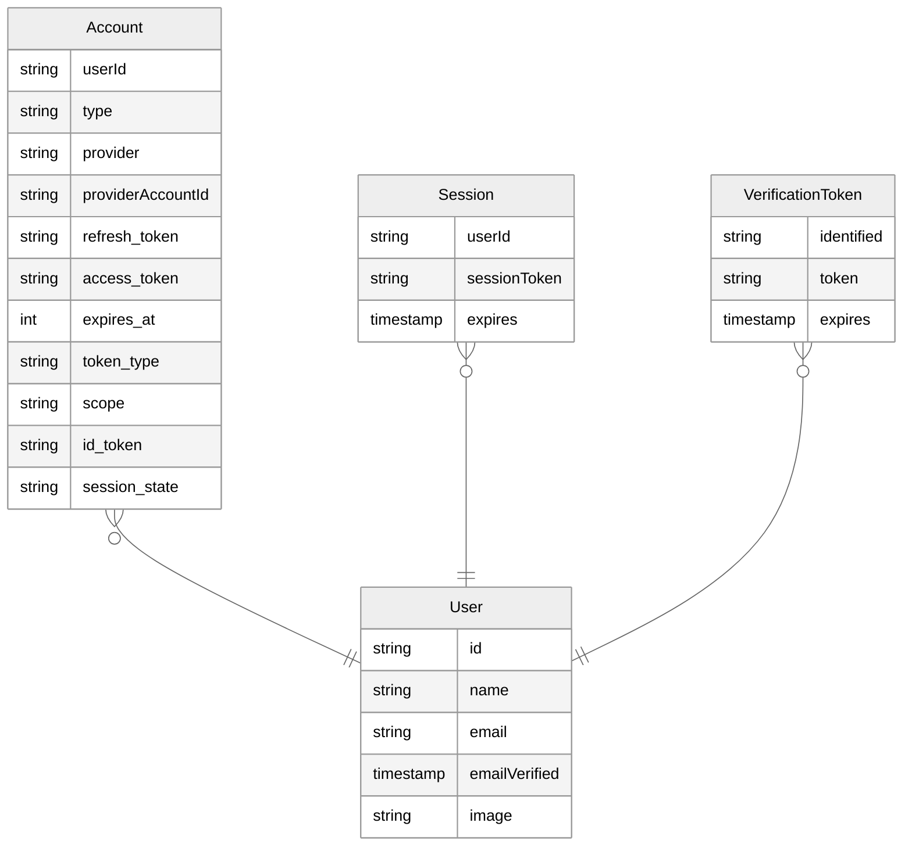

import { Callout } from "nextra/components"
import { Link } from "@/components/Link"
import manifest from "@/data/manifest.json"

# Database Adapters

<Callout type="info">
  Auth.js integrations save sessions in a cookie by default. Therefore, setting
  up a database is optional. However, if you want to persist user information in
  your own database, or you want to implement certain flows, you will need to
  use a Database Adapter.
</Callout>

**Database Adapters** are the bridge we use to connect Auth.js to your database. For instance, [when implementing magic links](/getting-started/authentication/email), the Email provider will require you to setup a database adapter to be able to store the [verification tokens](/concepts/database-models#verificationtoken-model) present on the links.

## Official Adapters

Below is a list of official adapters that are distributed as their own packages under the `@auth/`
namespace. Their source code is available in the [`nextauthjs/next-auth`
monorepo](https://github.com/nextauthjs/next-auth/tree/main/packages). If you're going to create a database adapter, please make sure you familiarise yourself [with the models](/concepts/database-models) Auth.js expects to be present and check out our "[creating a database adapter](/guides/creating-a-database-adapter)" guide.

  {Object.entries(manifest.adapters).map(([value, label]) => (
    <Link
      href={`/getting-started/adapters/${value}`}
      key={value}
      className="flex h-32 w-36 flex-col items-center justify-between rounded-lg border border-solid border-neutral-200 p-4 shadow-sm transition duration-300 hover:bg-neutral-50 dark:border-neutral-800 dark:hover:bg-neutral-950"
    >
      
      
{label}

    </Link>
  ))}

<Callout>
  If you don't find an adapter for your database or service of choice, you can
  create one yourself. Have a look at our guide on [how to create a database
  adapter](/guides/creating-a-database-adapter). If you create a new adapter,
  we'd love it if you [opened a
  PR](/guides/creating-a-database-adapter#official-adapter-guidelines) to share
  it with everyone!
</Callout>

## Models

This is a generic ER Diagram of what the full database schema should look like. Your database adapter of choice will include a template schema with more details for applying this schema to the underlying database. For more details, check out our [database models](/concepts/database-models) documentation. Please note, that the entire schema is not required for every use-case, for more details check out out our [database adapters guide](/guides/creating-a-database-adapter).

