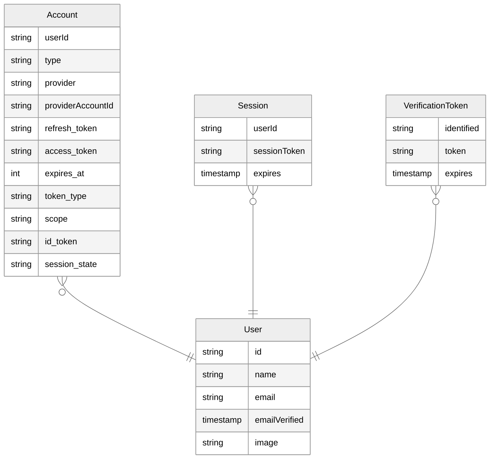

import { Callout } from "nextra/components";
import { Link } from "@/components/Link";
import manifest from "@/data/manifest.json";

{/** TODO: This whole page needs to have a similar stepper to the Authentication section for
providers **/}

# Setup a database

<Callout type="info">
  Auth.js integrations save sessions in a cookie by default. Therefore, setting
  up a database is optional. However, if you want to persist user information in
  your own database, or you want to implement certain flows, you will need to
  use a Database Adapter.
</Callout>

_Database Adapters_ are the bridge we use to connect to your database. For instance, [when
implementing magic links](/getting-started/passwordless-sendgrid-setup), the `EmailProvider` will require you to setup a database adapter to be able to store the [verification tokens](/concepts/database-models#verificationtoken-model) present on the links.

This is a generic ER Diagram of what the database schema should look like. Your database adapter of
choice will include a template schema with more details for the underlying database of choice
(MySQL, PostgreSQL, etc.).

<Callout>
  The database schema should look similar to this by default, however you can
  add or remove fields as you see fit. If you do, make sure to update the
  database adapter to match the schema you've defined. More details on what each
  model is used for and if you need it can be found
  [here](/guides/creating-a-database-adapter).
</Callout>

## Official adapters

Below is a list of official adapters that are distributed as their own packages under the `@auth/`
namespace. Their source code is available in the [next-auth
monorepo](https://github.com/nextauthjs/next-auth/tree/main/packages). If you're gonna setup a database, make sure you familiarise yourself [with the models Auth.js](/concepts/database-models) expects to be present.

  {Object.entries(manifest.adapters).map(([value, label]) => (
    <Link
      href={`/reference/adapter/${value}`}
      key={value}
      className="p-4 border border-solid border-slate-200 rounded-lg flex flex-col items-center justify-between w-36 shadow-lg h-32"
    >
      
      
{label}

    </Link>
  ))}

<Callout>
  If you don't find an adapter for your database or service of choice, you can
  create one yourself. Have a look at our guide on [how to create a database
  adapter](/guides/creating-a-database-adapter). If you create a new adapter,
  we'd love it if you [opened a
  PR](/guides/creating-a-database-adapter#official-adapter-guidelines) to share
  it with everyone!
</Callout>
