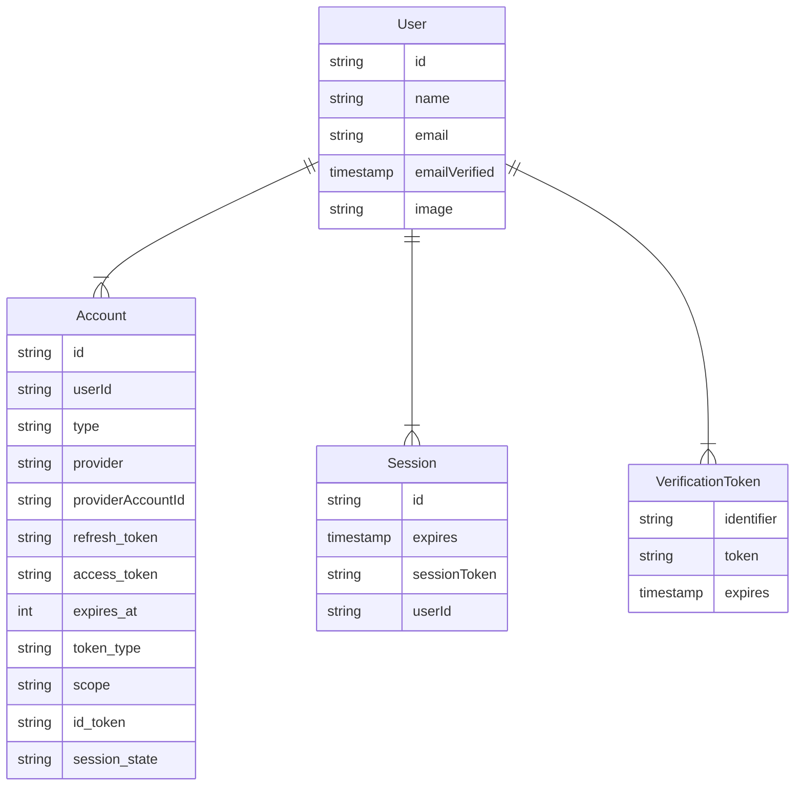

import { Steps, Callout, Tabs } from "nextra/components"
import { Code } from "@/components/Code"
import { Link } from "@/components/Link"
import { Accordion, Accordions } from "@/components/Accordion"
import { OAuthProviderSelect } from "@/components/OAuthProviderInstructions"

import { useState } from "react"
import { RichTabs } from "@/components/RichTabs"

import { Screenshot } from "@/components/Screenshot"
import MagicLink from "../../public/img/magic-links/start.webp"

import manifest from "@/data/manifest.json"

## Installation

<small>Next section: [Authentication methods](#authentication-methods)</small>

Start by installing the appropriate package for your framework.

<Code>
  <Code.Next>
    
    ```bash npm2yarn
    npm install next-auth@beta
    ```

  </Code.Next>
  <Code.Qwik>

    ```bash npm2yarn
    npm run qwik add auth
    ```

  </Code.Qwik>
  <Code.Svelte>
  
    ```bash npm2yarn
    npm install @auth/sveltekit
    ```
  </Code.Svelte>
  <Code.Express>
  
    ```bash npm2yarn
    npm install @auth/express
    ```
  
  </Code.Express>
</Code>

### Setup Environment

The only mandatory environment variable is `AUTH_SECRET`. This is must be a cryptographically random value. You can generate one via the [Auth.js CLI](https://cli.authjs.dev):

```bash
npx auth secret
```

This will also add it to your `.env` file, respecting the framework conventions (eg.: Next.js' `.env.local`).

<Callout type="info">
  The value is used to seal cookies and hash [email](#email) verification
  tokens.
</Callout>

### Configure

Next, create the Auth.js config file and object. This is where you can control the behaviour of the library and specify custom authentication logic, adapters, etc. We recommend all frameworks to create an `auth.ts` file in the project. In this file we'll pass in all the options to the framework specific initalization function and then export the route handler(s), signin and signout methods, and more.

<Callout type="info">
  You can name this file whatever you want and place it wherever you like, these
  are just conventions we've come up with.
</Callout>

<Code>
  <Code.Next>

1. Start by creating a new `auth.ts` file at the root of your app with the following content.

```ts filename="./auth.ts"
import NextAuth from "next-auth"

export const { handlers, signIn, signOut, auth } = NextAuth({
  providers: [],
})
```

2. Add a Route Handler under `/app/api/auth/[...nextauth]/route.ts`.

<Callout>
  This file must be an App Router Route Handler, however, the rest of your app
  can stay under `page/` if you'd like.
</Callout>

```ts filename="./app/api/auth/[...nextauth]/route.ts"
import { handlers } from "@/auth" // Referring to the auth.ts we just created
export const { GET, POST } = handlers
```

3. Add optional Middleware to keep the session alive, this will update the session expiry every time its called.

```ts filename="./middleware.ts"
export { auth as middleware } from "@/auth"
```

  </Code.Next>
  <Code.Qwik>

1. Start by creating a new `plugin@auth.ts` file in your `src/routes` directory with the following content.

```ts filename="/src/routes/plugin@auth.ts"
import { QwikAuth$ } from "@auth/qwik"

export const { onRequest, useSession, useSignIn, useSignOut } = QwikAuth$(
  () => ({
    providers: [...],
  })
)
```

  </Code.Qwik>
  <Code.Svelte>

1. Start by creating a new `auth.ts` file in your `src/` directory with the following content.

```ts filename="./src/auth.ts"
import { SvelteKitAuth } from "@auth/sveltekit"

export const { handle } = SvelteKitAuth({
  providers: [],
})
```

2. Re-export the `handle` method in SvelteKit's `src/hooks.server.ts` file.

```ts filename="./src/hooks.server.ts"
export { handle } from "./auth"
```

3. That handle function adds an `auth()` method onto our `event.locals`, which is available in any `+layout.server.ts` or `+page.server.ts` file. Therefore, we can access the session in our `load` function like this.

```ts filename="./src/routes/+layout.server.ts" {4}
import type { LayoutServerLoad } from "./$types"

export const load: LayoutServerLoad = async (event) => {
  const session = await event.locals.auth()

  return {
    session,
  }
}
```

  </Code.Svelte>
  <Code.Express>

1. Start by importing `ExpressAuth` and adding the handler to the auth route.

```ts filename="./src/routes/auth.route.ts" {1, 9}
import { ExpressAuth } from "@auth/express"
import express from "express"

const app = express()

// If your app is served through a proxy
// trust the proxy to allow us to read the `X-Forwarded-*` headers
app.set("trust proxy", true)
app.use("/auth/*", ExpressAuth({ providers: [] }))
```

Note this creates the Auth.js API, but does not yet protect resources. Continue on to [protecting resources](/getting-started/session-management/protecting) for more details.

  </Code.Express>
</Code>

## Database

<small>Next section: [Authentication methods](#authentication-methods)</small>

<Callout type="info">
  This section is optional. If you're using a provider that doesn't require a
  database, or you don't need to persist any data, you can skip to the [next
  section](#authentication-methods).
</Callout>

Auth.js holds very loose opinions when it comes to persisting data. You can use any database you like, even mix and match them - like for example using Redis for sessions and Magic Links, and SQL for persisting user and account data.
Learn more in the [create your own adapter](/guides/creating-a-database-adapter) guide for a more detailed explanation.

{/* TODO: Explain what model is needed when, what columns are optional, which ones aren't, etc. */}

Below is a graph of how an Auth.js database _might_ look like, however, when you create your database, you only need to create the tables/columns that you need.



<Callout type="info">
  Auth.js uses `camelCase` for the database rows that are coming from
  JavaScript, while respecting the conventional `snake_case` formatting for
  OAuth-related values. However, there is no strict requirement for this mixed
  format. Most built-in adapters support a configuration option to change the
  table and column names, and you can also create your own adapter and map the
  values however you like.
</Callout>

Official database adapters are available under the `@auth/` scope on npm. Their source code is available [in our monorepo](https://github.com/nextauthjs/next-auth/tree/main/packages).

<div>
  {Object.entries(manifest.adapters).map(([value, label]) => (
    <Link
      href={`/getting-started/adapters/${value}`}
      key={value}
      className="m-0.5 inline-flex items-center gap-1 rounded-md border-neutral-200 p-2 transition-colors duration-300 hover:bg-neutral-200 dark:hover:bg-neutral-600"
    >
      
      <span className="text-ellipsis whitespace-nowrap text-sm">{label}</span>
    </Link>
  ))}
</div>

<Callout>
  If you don't find an adapter for your database or service, you can create one
  yourself. Have a look at our guide on [how to create a database
  adapter](/guides/creating-a-database-adapter). If you create a new adapter,
  we'd love it if you [opened a
  PR](/guides/creating-a-database-adapter#official-adapter-guidelines) to share
  it with everyone!
</Callout>

## Authentication Methods

<small>Next section: [Signing in](#signing-in)</small>

In addition to the guides below, you can also use the [Auth.js CLI tool](https://cli.authjs.dev) inside your project:

```bash
npx auth add [provider]
```

### OAuth

<OAuthProviderSelect />

<Callout>
  Can't find yours? You can [configure any OAuth
  provider](/guides/configuring-oauth-providers#use-your-own-provider), even if
  it's not on the list.
</Callout>

<Callout type="info">
  Many providers are available in our hosted [example
  app](https://next-auth-example.vercel.app) to test out.
</Callout>

You can learn more about OAuth in our [Concepts: OAuth](/concepts/oauth).

### Email

This login mechanism starts by the user providing their email address at the login form. Then a **Verification Token** is sent to the provided email address. The user then has 24 hours to click the link in the email body to "consume" that token and register their account, otherwise the verification token will expire and they will have to request a new one.

<Callout>
  An Email Provider can be used with both [JSON Web Tokens](https://jwt.io/) and
  [database](/concepts/session-strategies#database-session) session, but
  **configuring a database** is necessary so that Auth.js can save the
  verification tokens and look them up when the user attempts to login.
</Callout>

### WebAuthn (Passkeys)

<Callout type="warning">
  The WebAuthn/Passkeys provider is currently experimental and not supported by
  all framework integrations yet.
</Callout>

#### Install peer dependencies

This provider requires the `@simplewebauthn/server` and `@simplewebauthn/browser` packages to be installed.

```bash npm2yarn
npm install @simplewebauthn/server@9.0.3 @simplewebauthn/browser@9.0.1
```

The `@simplewebauthn/browser` peer dependency **is only required for custom signin pages**. If you're using the Auth.js default pages, you can skip installing that peer dependency.

#### Apply the required schema Migrations

This is the raw SQL migration for PostgreSQL, for more details including example migrations for other databases, check out the updated Prisma schemas at the [`@auth/prisma-adapter` docs](/getting-started/adapters/prisma).

In short, the Passkeys provider requires an additional table called `Authenticator`.

```sql filename="./migration/add-webauthn-authenticator-table.sql"
-- CreateTable
CREATE TABLE "Authenticator" (
    "credentialID" TEXT NOT NULL,
    "userId" TEXT NOT NULL,
    "providerAccountId" TEXT NOT NULL,
    "credentialPublicKey" TEXT NOT NULL,
    "counter" INTEGER NOT NULL,
    "credentialDeviceType" TEXT NOT NULL,
    "credentialBackedUp" BOOLEAN NOT NULL,
    "transports" TEXT,
    PRIMARY KEY ("userId", "credentialID"),
    CONSTRAINT "Authenticator_userId_fkey" FOREIGN KEY ("userId") REFERENCES "User" ("id") ON DELETE CASCADE ON UPDATE CASCADE
);


-- CreateIndex
CREATE UNIQUE INDEX "Authenticator_credentialID_key" ON "Authenticator"("credentialID");
```

#### Update Auth.js Configuration

Add the `Passkeys` provider to your configuration. Also make sure you're using a compatible database adapter.

```ts filename="./auth.ts"
import Passkey from "next-auth/providers/passkey"
import { PrismaAdapter } from "@auth/prisma-adapter"
import { PrismaClient } from "@prisma/client"

const prisma = new PrismaClient()

export default {
  adapter: PrismaAdapter(prisma),
  providers: [Passkey],
  experimental: { enableWebAuthn: true },
}
```

If you're using the built-in Auth.js pages, then you are good to go! Navigating to your `/signin` route should include a "Signin with Passkeys" button.

#### Custom Pages

If you're using a custom signin page, you can leverage the `next-auth` `signIn` function to initiate WebAuthn registration and login flows with the following code.

<Callout>
  When using the WebAuthn `signIn` function, you'll also need the
  `@simplewebauth/browser` peer dependency installed.
</Callout>

```ts filename="app/login/page.tsx"
"use client"

import { useSession } from "next-auth/react"
import { signIn } from "next-auth/webauthn"

export default function Login() {
  const { data: session, update, status } = useSession()

  return (
    <div>
      {status === "authenticated" ? (
        <button onClick={() => signIn("passkey", { action: "register" })}>
          Register new Passkey
        </button>
      ) : status === "unauthenticated" ? (
        <button onClick={() => signIn("passkey")}>Sign in with Passkey</button>
      ) : null}
    </div>
  )
}
```

### Credentials

To setup Auth.js with any external authentication mechanisms or use a traditional username/email and password flow, we can use the `Credentials` provider. This provider is designed to forward any credentials inserted into the login form (i.e. username/password, but not limited to) to your authentication service.

<Callout type="warning">
  The industry has come a long way since usernames and passwords
  as the go-to mechanism for authenticating and authorizing users to
  web applications. Therefore, if possible, we recommend a more modern and
  secure authentication mechanism such as any of the [OAuth
  providers](/getting-started/authentication/oauth), [Email Magic
  Links](/getting-started/authentication/email), or [WebAuthn
  (Passkeys)](/getting-started/authentication/webauthn) options instead.

However, we also want to be flexible and support anything
you deem appropriate for your application and use case,
so there are no plans to remove this provider.

</Callout>

<Callout>
  By default, the Credentials provider does not persist data in the database.
  However, you can still create and save any data in your database, you just
  have to provide the necessary logic, eg. to encrypt passwords, add
  rate-limiting, add password reset functionality, etc.
</Callout>

<Steps>

#### Credentials Provider

First, let's initialize the `Credentials` provider in the Auth.js configuration file. You'll have to import the provider and add it to your `providers` array.

<Code>
<Code.Next>

```ts filename="./auth.ts" {2, 8}
import NextAuth from "next-auth"
import Credentials from "next-auth/providers/credentials"
// Your own logic for dealing with plaintext password strings; be careful!
import { saltAndHashPassword } from "@/utils/password"

export const { handlers, signIn, signOut, auth } = NextAuth({
  providers: [
    Credentials({
      // You can specify which fields should be submitted, by adding keys to the `credentials` object.
      // e.g. domain, username, password, 2FA token, etc.
      credentials: {
        email: {},
        password: {},
      },
      authorize: async (credentials) => {
        let user = null

        // logic to salt and hash password
        const pwHash = saltAndHashPassword(credentials.password)

        // logic to verify if the user exists
        user = await getUserFromDb(credentials.email, pwHash)

        if (!user) {
          // No user found, so this is their first attempt to login
          // Optionally, this is also the place you could do a user registration
          throw new Error("Invalid credentials.")
        }

        // return user object with their profile data
        return user
      },
    }),
  ],
})
```

</Code.Next>
<Code.Qwik>
  
```ts filename="/src/routes/plugin@auth.ts"
import { QwikAuth$ } from "@auth/qwik"
import Credentials from "@auth/qwik/providers/credentials"

export const { onRequest, useSession, useSignIn, useSignOut } = QwikAuth$(
  () => ({
    providers: [
      Credentials({
        credentials: {
          email: { label: "Email" },
          password: { label: "Password", type: "password" },
        },
        async authorize(credentials) {
          const response = await getUserFromDb(credentials)
          if (!response.ok) return null
          return (await response.json()) ?? null
        },
      }),
    ],
  })
)
```

</Code.Qwik>
<Code.Svelte>

```ts filename="./src/auth.ts" {2, 8}
import { SvelteKitAuth } from "@auth/sveltekit"
import Credentials from "@auth/sveltekit/providers/credentials"
// Your own logic for dealing with plaintext password strings; be careful!
import { saltAndHashPassword } from "@/utils/password"

export const { signIn, signOut, handle } = SvelteKitAuth({
  providers: [
    Credentials({
      // You can specify which fields should be submitted, by adding keys to the `credentials` object.
      // e.g. domain, username, password, 2FA token, etc.
      credentials: {
        email: {},
        password: {},
      },
      authorize: async (credentials) => {
        let user = null

        // logic to salt and hash password
        const pwHash = saltAndHashPassword(credentials.password)

        // logic to verify if user exists
        user = await getUserFromDb(credentials.email, pwHash)

        if (!user) {
          // No user found, so this is their first attempt to login
          // Optionally, this is also the place you could do a user registration
          throw new Error("Invalid credentials.")
        }

        // return JSON object with the user data
        return user
      },
    }),
  ],
})
```

Don't forget to re-export the `handle` in your `./src/hooks.server.ts` file.

```ts filename="./src/hooks.server.ts"
export { handle } from "./auth"
```

</Code.Svelte>

<Code.Express>

```ts filename="./src/routes/auth.route.ts" {2, 11}
import { ExpressAuth } from "@auth/express"
import Credentials from "@auth/express/providers/credentials"
import express from "express"
// Your own logic for dealing with plaintext password strings; be careful!
import { saltAndHashPassword } from "@/utils/password"

const app = express()
app.use(
  "/auth/*",
  ExpressAuth({
    providers: [
      Credentials({
        // You can specify which fields should be submitted, by adding keys to the `credentials` object.
        // e.g. domain, username, password, 2FA token, etc.
        credentials: {
          email: {},
          password: {},
        },
        authorize: async (credentials) => {
          let user = null

          // logic to salt and hash password
          const pwHash = saltAndHashPassword(credentials.password)

          // logic to verify if the user exists
          user = await getUserFromDb(credentials.email, pwHash)

          if (!user) {
            // No user found, so this is their first attempt to login
            // Optionally, this is also the place you could do a user registration
            throw new Error("Invalid credentials.")
          }

          // return user object with the their profile data
          return user
        },
      }),
    ],
  })
)
```

</Code.Express>
</Code>

<Callout type="info">
  If you're using TypeScript, you can [augment the `User`
  interface](/getting-started/typescript#module-augmentation) to match the
  response of your `authorize` callback, so whenever you read the user in other
  callbacks (like the `jwt`) the type will match correctly.
</Callout>

#### Signin Form

Finally, let's create a simple sign-in form.

<Code>
<Code.Next>

```tsx filename="./components/sign-in.tsx" {13, 17} /formData/
import { signIn } from "@/auth"

export function SignIn() {
  return (
    <form
      action={async (formData) => {
        "use server"
        await signIn("credentials", formData)
      }}
    >
      <label>
        Email
        <input name="email" type="email" />
      </label>
      <label>
        Password
        <input name="password" type="password" />
      </label>
      <button>Sign In</button>
    </form>
  )
}
```

</Code.Next>
<Code.NextClient>

```tsx filename="./components/sign-in.tsx"
"use client"
import { signIn } from "next-auth/react"

export function SignIn() {
  const credentialsAction = (formData: FormData) => {
    signIn("credentials", formData)
  }

  return (
    <form action={credentialsAction}>
      <label htmlFor="credentials-email">
        Email
        <input type="email" id="credentials-email" name="email" />
      </label>
      <label htmlFor="credentials-password">
        Password
        <input type="password" id="credentials-password" name="password" />
      </label>
      <input type="submit" value="Sign In" />
    </form>
  )
}
```

</Code.NextClient>
<Code.Qwik>

```ts filename="/src/routes/index.tsx"
import { component$ } from "@builder.io/qwik"
import { Form } from "@builder.io/qwik-city"
import { useSignIn } from "./plugin@auth"

export default component$(() => {
  const signInSig = useSignIn()

  return (
    <Form action={signInSig}>
      <label>
        Email
        <input name="email" type="email" />
      </label>
      <label>
        Password
        <input name="password" type="password" />
      </label>
      <button>Sign In</button>
    </Form>
  )
})
```

</Code.Qwik>
<Code.Svelte>

```svelte filename="src/route/+page.svelte" /bind:value/ /signIn/
<script>
  import { signIn } from "../auth"
  import { page } from "$app/stores"

  let email = ""
  let password = ""
</script>

<div>
  <form>
    <label>
      Email
      <input name="email" type="email" bind:value={email} />
    </label>
    <label>
      Password
      <input name="password" type="password" bind:value={password} />
    </label>
    <button on:click={() => signIn("credentials", { email, password })}>
      Log in
    </button>
  </form>
</div>
```

</Code.Svelte>

<Code.Express>

```html filename="views/signin.html"
<!doctype html>
<html lang="en">
  <head>
    <meta charset="UTF-8" />
    <meta name="viewport" content="width=device-width, initial-scale=1.0" />
    <title>Sign In</title>
  </head>
  <body>
    <h1>Sign In</h1>
    <form action="/auth/signin" method="POST">
      <label for="email">Email:</label>
      <input type="email" name="email" id="email" required />
      <br />
      <label for="password">Password:</label>
      <input type="password" name="password" id="password" required />
      <br />
      <button type="submit">Sign In</button>
    </form>
  </body>
</html>
```

</Code.Express>

</Code>

</Steps>

#### Validating credentials

Always validate the credentials server-side, i.e. by leveraging a schema validation library like [Zod](https://zod.dev).

```bash npm2yarn
npm install zod
```

Next, we'll set up the schema and parsing in our `auth.ts` configuration file, using the `authorize` callback on the `Credentials` provider.

<Code>
<Code.Next>

```ts filename="./lib/zod.ts"
import { object, string } from "zod"

export const signInSchema = object({
  email: string({ required_error: "Email is required" })
    .min(1, "Email is required")
    .email("Invalid email"),
  password: string({ required_error: "Password is required" })
    .min(1, "Password is required")
    .min(8, "Password must be more than 8 characters")
    .max(32, "Password must be less than 32 characters"),
})
```

```ts filename="./auth.ts" {22}
import NextAuth from "next-auth"
import { ZodError } from "zod"
import Credentials from "next-auth/providers/credentials"
import { signInSchema } from "./lib/zod"
// Your own logic for dealing with plaintext password strings; be careful!
import { saltAndHashPassword } from "@/utils/password"
import { getUserFromDb } from "@/utils/db"

export const { handlers, auth } = NextAuth({
  providers: [
    Credentials({
      // You can specify which fields should be submitted, by adding keys to the `credentials` object.
      // e.g. domain, username, password, 2FA token, etc.
      credentials: {
        email: {},
        password: {},
      },
      authorize: async (credentials) => {
        try {
          let user = null

          const { email, password } = await signInSchema.parseAsync(credentials)

          // logic to salt and hash password
          const pwHash = saltAndHashPassword(password)

          // logic to verify if the user exists
          user = await getUserFromDb(email, pwHash)

          if (!user) {
            throw new Error("Invalid credentials.")
          }

          // return JSON object with the user data
          return user
        } catch (error) {
          if (error instanceof ZodError) {
            // Return `null` to indicate that the credentials are invalid
            return null
          }
        }
      },
    }),
  ],
})
```

</Code.Next>
<Code.Qwik>

```ts filename="./lib/zod.ts"
import { object, string } from "zod"

export const signInSchema = object({
  email: string({ required_error: "Email is required" })
    .min(1, "Email is required")
    .email("Invalid email"),
  password: string({ required_error: "Password is required" })
    .min(1, "Password is required")
    .min(8, "Password must be more than 8 characters")
    .max(32, "Password must be less than 32 characters"),
})
```

```ts filename="/src/routes/plugin@auth.ts"
import { QwikAuth$ } from "@auth/qwik"
import Credentials from "@auth/qwik/providers/credentials"
import { signInSchema } from "./lib/zod"

export const { onRequest, useSession, useSignIn, useSignOut } = QwikAuth$(
  () => ({
    providers: [
      Credentials({
        credentials: {
          email: { label: "Email" },
          password: { label: "Password", type: "password" },
        },
        async authorize(credentials) {
          const { email, password } = await signInSchema.parseAsync(credentials)

          // Your logic here
        },
      }),
    ],
  })
)
```

</Code.Qwik>
<Code.Svelte>

```ts filename="./lib/zod.ts"
import { object, string } from "zod"

export const signInSchema = object({
  email: string({ required_error: "Email is required" })
    .min(1, "Email is required")
    .email("Invalid email"),
  password: string({ required_error: "Password is required" })
    .min(1, "Password is required")
    .min(8, "Password must be more than 8 characters")
    .max(32, "Password must be less than 32 characters"),
})
```

```ts filename="./auth.ts" {22-23}
import SvelteKitAuth from "@auth/sveltekit"
import { ZodError } from "zod"
import Credentials from "@auth/sveltekit/providers/credentials"
import { signInSchema } from "./lib/zod"
// Your own logic for dealing with plaintext password strings; be careful!
import { saltAndHashPassword } from "@/utils/password"
import { getUserFromDb } from "@/utils/db"

export const { handle } = SvelteKitAuth({
  providers: [
    Credentials({
      // You can specify which fields should be submitted, by adding keys to the `credentials` object.
      // e.g. domain, username, password, 2FA token, etc.
      credentials: {
        email: {},
        password: {},
      },
      authorize: async (credentials) => {
        try {
          let user = null

          const { email, password } =
            await createUserSchema.parseAsync(credentials)

          // logic to salt and hash password
          const pwHash = saltAndHashPassword(password)

          // logic to verify if the user exists
          user = await getUserFromDb(email, pwHash)

          if (!user) {
            throw new Error("Invalid credentials.")
          }

          // return JSON object with the user data
          return user
        } catch (error) {
          if (error instanceof ZodError) {
            // Return `null` to indicate that the credentials are invalid
            return null
          }
        }
      },
    }),
  ],
})
```

</Code.Svelte>
</Code>

## Signing in

<small>Next section: [Signing out](#signing-out)</small>

TODO:

## Signing out

<small>Next section: [Session management](#session-management)</small>

TODO:

## Session management

<small>Next section: [TypeScript](#typescript)</small>

TODO:

### Protecting resources

TODO:

## TypeScript

<small>Next section: [Deployment](#deployment)</small>

Auth.js is fully authored in TypeScript. It comes with its own type definitions to use in your project.

Even if you don't use TypeScript, IDEs like VS Code will pick this up to provide you with a better developer experience. While you are typing, you will get suggestions about what certain objects/functions look like, and sometimes links to documentation, examples, and other valuable resources.

### Philosophy

We have chosen [module augmentation](https://www.typescriptlang.org/docs/handbook/declaration-merging.html#module-augmentation)
over [generics](https://www.typescriptlang.org/docs/handbook/2/generics.html) as the main technique to type Auth.js resources across your application in case you extend them.

<details>
<summary>
<b>Why not use <a href="https://www.typescriptlang.org/docs/handbook/2/generics.html">generics</a>?</b>
</summary>
The interfaces that are shared across submodules are not passed to Auth.js library functions as generics.

Whenever these types are used, the functions always expect to return these formats. With generics, one might be able to override the type in one place, but not the other, which would cause the types to be out of sync with the implementation.

With module augmentation, you defined the types once, and you can be sure that they are always the same where it's expected.

</details>

### Module Augmentation

Auth.js libraries come with certain interfaces that are shared across submodules and different Auth.js libraries (For example: `next-auth` and `@auth/prisma-adapter` will rely on types from `@auth/core`).

Good examples of such interfaces are `Session` or `User`. You can use TypeScript's [Module
Augmentation](https://www.typescriptlang.org/docs/handbook/declaration-merging.html#module-augmentation) to extend these types to add your own properties across Auth.js without having to pass generic all over the place.

Let's look at extending `Session` for example.

<Code>
<Code.Next>

```ts filename="auth.ts"
import NextAuth, { type DefaultSession } from "next-auth"

declare module "next-auth" {
  /**
   * Returned by `auth`, `useSession`, `getSession` and received as a prop on the `SessionProvider` React Context
   */
  interface Session {
    user: {
      /** The user's postal address. */
      address: string
      /**
       * By default, TypeScript merges new interface properties and overwrites existing ones.
       * In this case, the default session user properties will be overwritten,
       * with the new ones defined above. To keep the default session user properties,
       * you need to add them back into the newly declared interface.
       */
    } & DefaultSession["user"]
  }
}

export const { auth, handlers } = NextAuth({
  callbacks: {
    session({ session, token, user }) {
      // `session.user.address` is now a valid property, and will be type-checked
      // in places like `useSession().data.user` or `auth().user`
      return {
        ...session,
        user: {
          ...session.user,
          address: user.address,
        },
      }
    },
  },
})
```

</Code.Next>
<Code.Qwik>

```ts filename="plugin@auth.ts"
import { DefaultSession, QwikAuth$ } from "@auth/qwik"

declare module "@auth/qwik" {
  /**
   * Returned by the `useSession` hook and the `session` object in the sharedMap
   */
  interface Session {
    user: {
      /** The user's postal address. */
      address: string
      /**
       * By default, TypeScript merges new interface properties and overwrites existing ones.
       * In this case, the default session user properties will be overwritten,
       * with the new ones defined above. To keep the default session user properties,
       * you need to add them back into the newly declared interface.
       */
    } & DefaultSession["user"]
  }
}

export const { onRequest, useSession, useSignIn, useSignOut } = QwikAuth$(
  () => ({
    callbacks: {
      session({ session, token, user }) {
        // `session.user.address` is now a valid property, and will be type-checked
        // in places like `useSession().user` or `sharedMap.get('session').user`
        return {
          ...session,
          user: {
            ...session.user,
            address: user.address,
          },
        }
      },
    },
  })
)
```

</Code.Qwik>
<Code.Svelte>

```ts filename="auth.ts"
import SvelteKitAuth, { type DefaultSession } from "@auth/sveltekit"

declare module "@auth/sveltekit" {
  interface Session {
    user: {
      userId: string
      /**
       * By default, TypeScript merges new interface properties and overwrites existing ones.
       * In this case, the default session user properties will be overwritten,
       * with the new ones defined above. To keep the default session user properties,
       * you need to add them back into the newly declared interface.
       */
    } & DefaultSession["user"]
  }
}

export const { handle } = SvelteKitAuth({
  callbacks: {
    session: async ({ session, token }) => {
      if (token) {
        session.user.userId = token.sub
      }
      // `session.user.userId` is now a valid property, and will be type-checked
      // in places like `useSession().data.user` or `auth().user`
      return session
    },
  },
})
```

</Code.Svelte>
</Code>

Module augmentation is not limited to specific interfaces. You can augment any `interface` we've defined, here are some of the more common interfaces that you might want to override based on your use case.

```ts filename="types.d.ts"
declare module "next-auth" {
  /**
   * The shape of the user object returned in the OAuth providers' `profile` callback,
   * or the second parameter of the `session` callback, when using a database.
   */
  interface User {}
  /**
   * The shape of the account object returned in the OAuth providers' `account` callback,
   * Usually contains information about the provider being used, like OAuth tokens (`access_token`, etc).
   */
  interface Account {}

  /**
   * Returned by `useSession`, `auth`, contains information about the active session.
   */
  interface Session {}
}

// The `JWT` interface can be found in the `next-auth/jwt` submodule
import { JWT } from "next-auth/jwt"

declare module "next-auth/jwt" {
  /** Returned by the `jwt` callback and `auth`, when using JWT sessions */
  interface JWT {
    /** OpenID ID Token */
    idToken?: string
  }
}
```

<Callout type="info">
  The module declaration can be added to any file that is
  ["included"](https://www.typescriptlang.org/tsconfig#include) in your
  project&apos;s `tsconfig.json`.
</Callout>

### Resources

1. [TypeScript documentation: Module Augmentation](https://www.typescriptlang.org/docs/handbook/declaration-merging.html#module-augmentation)
2. [DigitalOcean: Module Augmentation in TypeScript](https://www.digitalocean.com/community/tutorials/typescript-module-augmentation)
3. [Creating a Database Adapter](/guides/creating-a-database-adapter)

## Deployment

<small>Next section: [Observability](#observability)</small>

### Environment Variables

- `AUTH_SECRET`: Used to encrypt sessions, hash tokens, etc. You can generate one using the following command:

```bash npm2yarn
npm exec auth secret
```

<Callout type="info">
  You can rotate your secret without invalidating active sessions, by also
  setting `AUTH_SECRET_1` up to `AUTH_SECRET_3`. The lowest number will be
  preferred. Once you are confident all new sessions use the new secret, you can
  remove the old one.
</Callout>

- `AUTH_URL`: You may set this to a full URL - including the path up to your handlers, eg.: `/api/auth`- in case you host behind a reverse proxy, or similar, for example, `AUTH_URL=http://localhost:3000/web/auth`. When set, `AUTH_TRUST_HOST` is unnecessary.
- `AUTH_TRUST_HOST`: Set to `true` so Auth.js can trust the hosting provider to santizize the `host`, `x-forwarded-host` and `x-forwarded-proto` headers.

  Auth.js will try to detect the if you host on a trustable hosting provider, in which case you don't need to set this variable. Currently Vercel (`VERCEL`) and Cloudflare (`CF_PAGES`) are supported.

- `AUTH_REDIRECT_PROXY_URL`: See [Securing a multiple deployments](#securing-multiple-deployments) for more information.

  Providers relying on `response_mode=form_post` (like Apple) do not support this setting.

If you are using an [OAuth Provider](/concepts/oauth), your provider will provide you with a **Client ID** and **Client Secret** that you will need to set as environment variables as well (in the case of an OIDC provider, like Auth0, a third `issuer` value might be also required, refer to the provider's specific documentation).

<Callout type="info">
Auth.js supports **environment variable inference**, meaning that if you name your provider environment variables following a specific syntax, you won't need to explicitly pass them to the providers in your configuration.

Client ID's and client secrets should be named `AUTH_[PROVIDER]_ID` and `AUTH_[PROVIDER]_SECRET`. If your provider requires an issuer, that should be named `AUTH_[PROVIDER]_ISSUER`. For example:

```bash
AUTH_OKTA_ID=abc
AUTH_OKTA_SECRET=abc
AUTH_OKTA_ISSUER=abc
```

For more information, check out our [environment variables](/guides/environment-variables) page.

</Callout>

<Callout>
  For consistency, we recommend prefixing all Auth.js environment variables with
  `AUTH_`. This way we can better autodetect them, and they can also be
  distinguished from other environment variables more easily.
</Callout>

### Serverless

1. Create the required [environment variables](#environment-variables) for your desired environments. Don't forget to also add the required environment variables for your provider(s) of choice (i.e. OAuth `clientId` / `clientSecret`, etc.).
2. When using an OAuth provider, make sure the callback URL for your production URL is setup correctly. Many OAuth providers will only allow you to set 1 `callbackUrl` per OAuth application. In which case, you'll need to create separate applications for each environment (development, production, etc.). Other providers, like Google, allow you to add many `callbackUrl`s to one application.
   - By default, the callbackUrl for `next-auth` (Next.js) applications should look something like this: `https://company.com/api/auth/callback/[provider]` (replace `company.com` with your domain and `provider` with the provider name, i.e. `github`).
   - All other frameworks (`@auth/sveltekit`, `@auth/express`, etc.), by default, will use the path `/auth/callback/[provider]`.
3. Deploy! After having setup those two prerequisites, you should be able to deploy and run your Auth.js application on Netlify, Vercel, etc.

<Callout type="warning">
  If you are storing users in a [database](/getting-started/database), we
  recommend using a different OAuth app for development/production so that you
  don't mix your test and production user base.
</Callout>

### Self-hosted

Auth.js can also be deployed anywhere you can deploy your framework of choice. Check out the framework's documentation on self-hosting.

- Docker: In a Docker environment, make sure to set either `trustHost: true` in your Auth.js configuration or the `AUTH_TRUST_HOST` environment variable to `true`.

Our example application is also hosted via Docker [here](https://nextjs-docker-example.authjs.dev) (see the [source code](https://github.com/nextauthjs/next-auth-example)). Below is an example `Dockerfile` for a Next.js application using Auth.js.

```docker filename="Dockerfile"
# syntax=docker/dockerfile:1
# syntax=docker/dockerfile:1
FROM node:20-alpine AS base

# Install dependencies only when needed
FROM base AS deps
# Check https://github.com/nodejs/docker-node/tree/b4117f9333da4138b03a546ec926ef50a31506c3#nodealpine to understand why libc6-compat might be needed.
RUN apk add --no-cache libc6-compat
WORKDIR /app

# Install dependencies
COPY package.json pnpm-lock.yaml* ./
RUN corepack enable pnpm && pnpm i --frozen-lockfile

# Rebuild the source code only when needed
FROM base AS builder
WORKDIR /app
COPY --from=deps /app/node_modules ./node_modules
COPY . .

# Next.js collects completely anonymous telemetry data about general usage.
# Learn more here: https://nextjs.org/telemetry
# Uncomment the following line in case you want to disable telemetry during the build.
# ENV NEXT_TELEMETRY_DISABLED 1

RUN corepack enable pnpm && pnpm build

# Production image, copy all the files and run next
FROM base AS runner
WORKDIR /app

ENV NODE_ENV production
# Uncomment the following line in case you want to disable telemetry during runtime.
# ENV NEXT_TELEMETRY_DISABLED 1

RUN addgroup --system --gid 1001 nodejs
RUN adduser --system --uid 1001 nextjs

COPY --from=builder /app/public ./public

# Set the correct permission for prerender cache
RUN mkdir .next
RUN chown nextjs:nodejs .next

# Automatically leverage output traces to reduce image size
# https://nextjs.org/docs/advanced-features/output-file-tracing
COPY --from=builder --chown=nextjs:nodejs /app/.next/standalone ./
COPY --from=builder --chown=nextjs:nodejs /app/.next/static ./.next/static

USER nextjs

EXPOSE 3000

ENV PORT 3000
ENV HOSTNAME "0.0.0.0"

# server.js is created by next build from the standalone output
# https://nextjs.org/docs/pages/api-reference/next-config-js/output
CMD ["node", "server.js"]
```

### Securing multiple deployments

OAuth providers in general cannot be configured to allow multiple callback URLs or using a wildcard.

However, Auth.js **supports multiple deployments**, even **with most OAuth providers**. The idea is to have one deployment which proxies authentication requests to the dynamic URLs of your main application. So you could have 1 stable deployment, like at `auth.company.com` where you would point all your OAuth provider's `callbackUrl`s, and this application would then, upon successful authentication, redirect the user back to the preview deploy URL, like `https://git-abc123-myapp.vercel.app`. Follow these steps to get started with securing preview deploys with Auth.js.

A common use case is to use the same OAuth client for all preview deployments.

Here is how to achieve this:

1. Determine a stable deployment URL. For example, a deployment whose URL does not change between builds, for example. `auth.yourdomain.com` (using a subdomain is not a requirement, this can be the main site's URL too, for example.)
2. Set `AUTH_REDIRECT_PROXY_URL` in all deployments to the stable URL, including the path from where Auth.js handles the routes. Eg.: (`https://auth.yourdomain.com/api/auth`).
3. Point the callback/redirect URL in your OAuth provider's configuration to use the stable deployment URL. For example, for GitHub it would be `https://auth.yourdomain.com/api/auth/callback/github`.
4. Make sure that `AUTH_SECRET` is the same for all deployments that need to support the same OAuth credentials

<details>
<summary>
<b>How does this work?</b>
</summary>
To support multiple deployments, Auth.js requires a deployment URL that is stable across deploys as a redirect proxy server.

It will redirect the OAuth callback request to the stable deployment URL, but only when the `AUTH_REDIRECT_PROXY_URL` environment variable is set.

When a user initiates an OAuth sign-in flow on a configured deployment URL, it saves its URL in the `state` - encrypted - query parameter but set the `redirect_uri` to the stable deployment.

Then, the OAuth provider will redirect the user to the stable URL mentioned above, which will verify the `state` parameter and redirect the user to the original URL if the `state` is valid. This is secured by relying on the same server-side `AUTH_SECRET` for the stable deployment and the other deployments.

</details>

## Observability

<small>Next section: [Congratulations](#congratulations)</small>

To pass on your current user's details on to your observability tools, you can use the callbacks provided by Auth.js. For example, in the `session` callback, you could pass the `user.id` on to Sentry.

```ts filename="auth.ts"
import * as Sentry from "@sentry/browser"
import NextAuth from "next-auth"

export const { handlers, auth, signIn, signOut } = NextAuth({
  callbacks: {
    session({ session, user }) {
      const scope = Sentry.getCurrentScope()

      scope.setUser({
        id: user.id,
        email: user.email,
      })

      return session
    },
  },
})
```

## Congratulations

You have learnt the basics of Auth.js and successfully configured it in your application.

- For more in-depth customization and advanced use-cases, check out our [Guides](/guides).
- Check out our hosted [examples](/about#examples) for more complete implementations.
- Or learn more about auth concepts in the [concepts](/concepts) section. (Not only for Auth.js users!).
