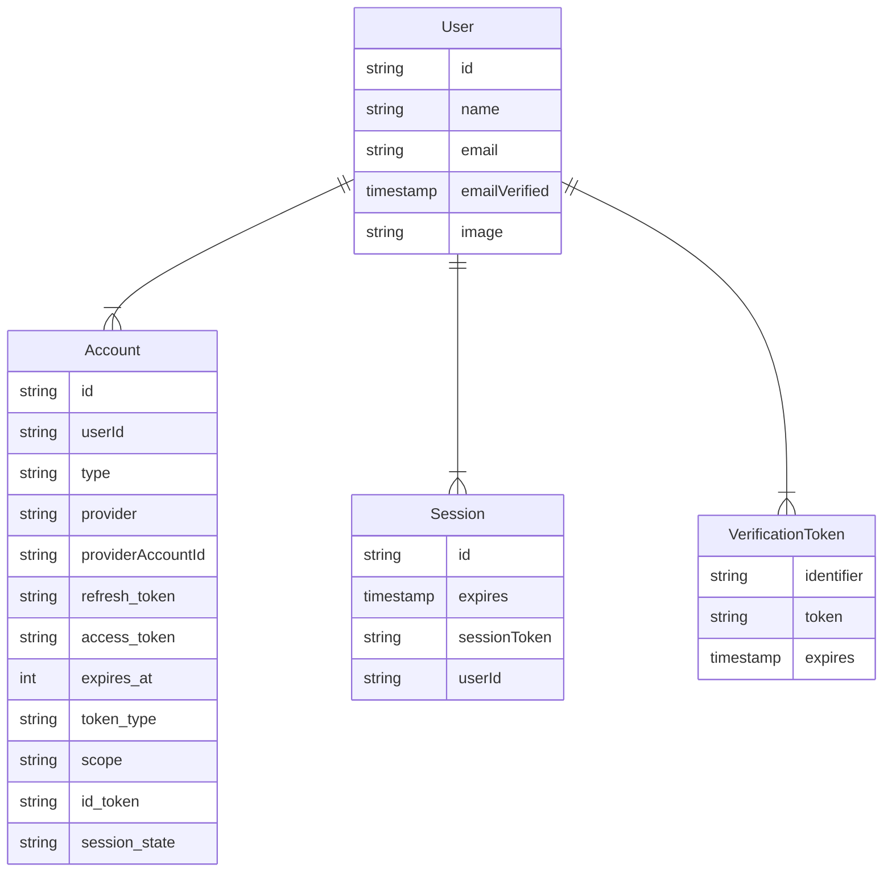
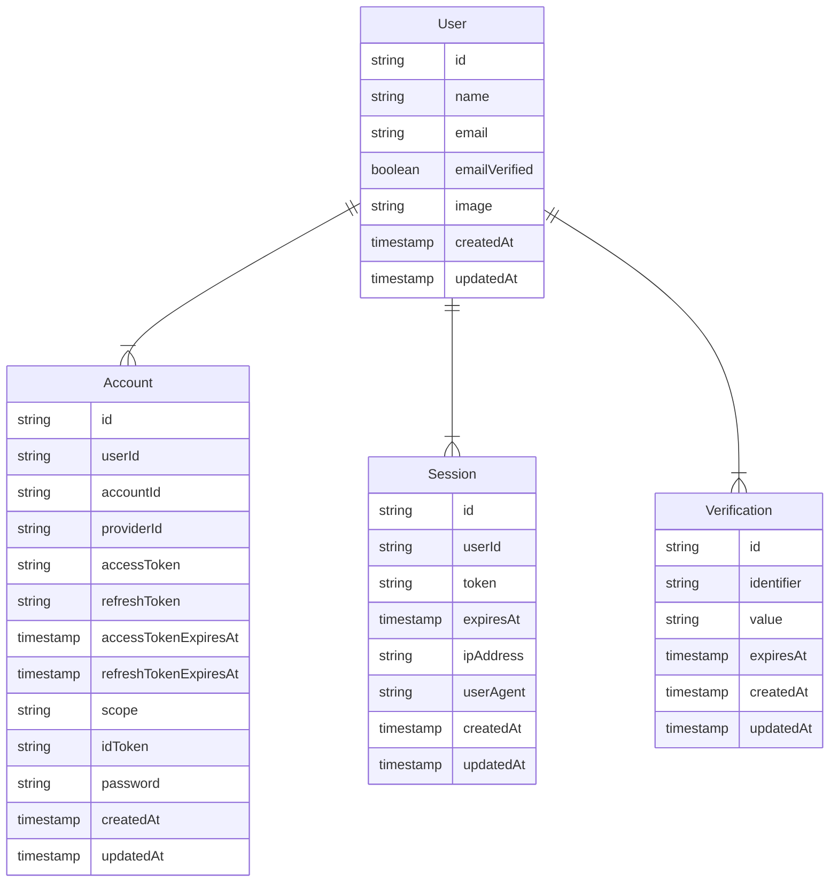

import { Callout, Tabs } from "nextra/components"

## Introduction

In this guide, we'll walk through the steps to migrate a project from Auth.js to [Better Auth](https://www.better-auth.com). Since these projects have different design philosophies, the migration requires careful planning and work. If your current setup is working well, there's no urgent need to migrate. Better Auth team continues to handle security patches and critical issues for Auth.js.

However, if you're starting a new project or facing challenges with your current setup, we strongly recommend using Better Auth. Our roadmap includes features previously exclusive to Auth.js, and we hope this will unite the ecosystem more strongly without causing fragmentation.

## 1. Create Better Auth Instance

Before starting the migration process, set up Better Auth in your project. Follow the [installation guide](https://www.better-auth.com/docs/installation) to get started.

For example, if you use the GitHub OAuth provider, here is a comparison of the `auth.ts` file.

<Tabs items={["Auth.js", "Better Auth"]}>
<Tabs.Tab>
```ts 
import NextAuth from "next-auth"
import GitHub from "next-auth/providers/github"
  
export const { handlers, signIn, signOut, auth } = NextAuth({
  providers: [GitHub],
})
```
</Tabs.Tab>

<Tabs.Tab>
```ts
import { betterAuth } from "better-auth";

export const auth = betterAuth({
  socialProviders: { 
    github: { 
      clientId: process.env.GITHUB_CLIENT_ID!, 
      clientSecret: process.env.GITHUB_CLIENT_SECRET!, 
    }, 
  }, 
})
```
</Tabs.Tab>
</Tabs>

<Callout type="info">
  Now Better Auth supports stateless session management without any database. If
  you were using a Database adapter in Auth.js, you can refer to the [Database
  models](#6-database-models) below to check the differences with Better Auth's
  core schema.
</Callout>

## 2. Create Client Instance

This client instance includes a set of functions for interacting with the Better Auth server instance. For more information, see [here](https://www.better-auth.com/docs/concepts/client).

```ts filename="auth-client.ts"
import { createAuthClient } from "better-auth/react"

export const authClient = createAuthClient()
```

## 3. Update the Route Handler

Rename the `/app/api/auth/[...nextauth]` folder to `/app/api/auth/[...all]` to avoid confusion. Then, update the `route.ts` file as follows:

<Tabs items={["Auth.js", "Better Auth"]}>
<Tabs.Tab>
```ts 
import { handlers } from "@/lib/auth"

export const { GET, POST } = handlers
```
</Tabs.Tab>

<Tabs.Tab>
```ts
import { auth } from "@/lib/auth";
import { toNextJsHandler } from "better-auth/next-js";

export const { POST, GET } = toNextJsHandler(auth)
```
</Tabs.Tab>
</Tabs>

## 4. Session Management

In this section, we'll look at how to manage sessions in Better Auth compared to Auth.js. For more information, see [here](https://www.better-auth.com/docs/concepts/session-management).

### Client-side

#### Sign In

Here are the differences between Auth.js and Better Auth for signing in users. For example, with the GitHub OAuth provider:

<Tabs items={["Auth.js", "Better Auth"]}>
<Tabs.Tab>
```ts 
"use client"

import { signIn } from "next-auth/react"

signIn("github")

````
</Tabs.Tab>

<Tabs.Tab>
```ts
"use client"

import { authClient } from "@/lib/auth-client";

const { data, error } = await authClient.signIn.social({
  provider: "github",
})
````

</Tabs.Tab>
</Tabs>

#### Sign Out

Here are the differences between Auth.js and Better Auth when signing out users.

<Tabs items={["Auth.js", "Better Auth"]}>
<Tabs.Tab>
```ts 
"use client"

import { signOut } from "next-auth/react"

signOut()

````
</Tabs.Tab>

<Tabs.Tab>
```ts
"use client"

import { authClient } from "@/lib/auth-client";

const { data, error } = await authClient.signOut()
````

</Tabs.Tab>
</Tabs>

#### Get Session

Here are the differences between Auth.js and Better Auth for getting the current active session.

<Tabs items={["Auth.js", "Better Auth"]}>
<Tabs.Tab>
```ts 
"use client"

import { useSession } from "next-auth/react"

const { data, status, update } = useSession()

````
</Tabs.Tab>

<Tabs.Tab>
```ts
"use client"

import { authClient } from "@/lib/auth-client";

const { data, error, refetch, isPending, isRefetching } = authClient.useSession()
````

</Tabs.Tab>
</Tabs>

### Server-side

#### Sign In

Here are the differences between Auth.js and Better Auth for signing in users. For example, with the GitHub OAuth provider:

<Tabs items={["Auth.js", "Better Auth"]}>
<Tabs.Tab>
```ts 
import { signIn } from "@/lib/auth"

await signIn("github")

````
</Tabs.Tab>

<Tabs.Tab>
```ts
import { auth } from "@/lib/auth";

const { redirect, url } = await auth.api.signInSocial({
  body: {
    provider: "github",
  },
})
````

</Tabs.Tab>
</Tabs>

#### Sign Out

Here are the differences between Auth.js and Better Auth when signing out users.

<Tabs items={["Auth.js", "Better Auth"]}>
<Tabs.Tab>
```ts 
import { signOut } from "@/lib/auth"

await signOut()

````
</Tabs.Tab>

<Tabs.Tab>
```ts
import { auth } from "@/lib/auth";
import { headers } from "next/headers";

const { success } = await auth.api.signOut({
  headers: await headers(),
})
````

</Tabs.Tab>
</Tabs>

#### Get Session

Here are the differences between Auth.js and Better Auth for getting the current active session.

<Tabs items={["Auth.js", "Better Auth"]}>
<Tabs.Tab>
```ts 
import { auth } from "@/lib/auth";

const session = await auth()

````
</Tabs.Tab>

<Tabs.Tab>
```ts
import { auth } from "@/lib/auth";
import { headers } from "next/headers";

const session = await auth.api.getSession({
  headers: await headers(),
})
````

</Tabs.Tab>
</Tabs>

## 5. Protecting Resources

> Proxy (Middleware) is not intended for slow data fetching. While Proxy can be helpful for optimistic checks such as permission-based redirects, it should not be used as a full session management or authorization solution. - [Next.js docs](https://nextjs.org/docs/app/getting-started/proxy#use-cases)

Auth.js offers approaches using Proxy (Middleware), but Better Auth recommend handling auth checks on each page or route rather than in a Proxy or Layout. Here is a basic example of protecting resources with Better Auth.

<Tabs items={["Client-side", "Server-side"]}>
<Tabs.Tab>
```ts filename="app/dashboard/page.tsx"
"use client";

import { authClient } from "@/lib/auth-client"
import { redirect } from "next/navigation"

const DashboardPage = () => {
const { data, error, isPending } = authClient.useSession();

if (isPending) {
return <div>Pending</div>;
}
if (!data || error) {
redirect("/sign-in");
}

return (

<div>
  <h1>Welcome {data.user.name}</h1>
</div>
); };

export default DashboardPage;
```
</Tabs.Tab>

<Tabs.Tab>
```ts filename="app/dashboard/page.tsx"
import { auth } from "@/lib/auth";
import { headers } from "next/headers";
import { redirect } from "next/navigation";

const DashboardPage = async () => {
const session = await auth.api.getSession({
headers: await headers(),
});

if (!session) {
redirect("/sign-in");
}

return (

<div>
  <h1>Welcome {session.user.name}</h1>
</div>
); };

export default DashboardPage
```
</Tabs.Tab>
</Tabs>

## 6. Database models

Both Auth.js and Better Auth provide stateless (JWT) and database session strategies. If you were using the database session strategy in Auth.js and plan to continue using it in Better Auth, you will also need to migrate your database.

Just like Auth.js has database models, Better Auth also has a core schema. In this section, we'll compare the two and explore the differences between them.

<Tabs items={["Auth.js", "Better Auth"]}>
<Tabs.Tab>

</Tabs.Tab>
<Tabs.Tab>

</Tabs.Tab>
</Tabs>

### Comparison

Table: <strong className='underline italic'>User</strong>

- `name`, `email`, and `emailVerified` are required in Better Auth, while optional in Auth.js
- `emailVerified` uses a boolean in Better Auth, while Auth.js uses a timestamp
- Better Auth includes `createdAt` and `updatedAt` timestamps

Table: <strong className='underline italic'>Session</strong>

- Better Auth uses `token` instead of `sessionToken`
- Better Auth uses `expiresAt` instead of `expires`
- Better Auth includes `ipAddress` and `userAgent` fields
- Better Auth includes `createdAt` and `updatedAt` timestamps

Table: <strong className='underline italic'>Account</strong>

- Better Auth uses camelCase naming (e.g. `refreshToken` vs `refresh_token`)
- Better Auth includes `accountId` to distinguish between the account ID and internal ID
- Better Auth uses `providerId` instead of `provider`
- Better Auth includes `accessTokenExpiresAt` and `refreshTokenExpiresAt` for token management
- Better Auth includes `password` field to support built-in credential authentication
- Better Auth does not have a `type` field as it's determined by the `providerId`
- Better Auth removes `token_type` and `session_state` fields
- Better Auth includes `createdAt` and `updatedAt` timestamps

Table: <strong className='underline italic'>VerificationToken -> Verification</strong>

- Better Auth uses `Verification` table instead of `VerificationToken`
- Better Auth uses a single `id` primary key instead of composite primary key
- Better Auth uses `value` instead of `token` to support various verification types
- Better Auth uses `expiresAt` instead of `expires`
- Better Auth includes `createdAt` and `updatedAt` timestamps

<Callout type="info">
  If you were using Auth.js v4, note that v5 does not introduce any breaking
  changes to the database schema. Optional fields like `oauth_token_secret` and
  `oauth_token` can be removed if you are not using them. Rarely used fields
  like `refresh_token_expires_in` can also be removed.
</Callout>

### Customization

You may have extended the database models or implemented additional logic in Auth.js. Better Auth allows you to customize the core schema in a type-safe way. You can also define custom logic during the lifecycle of database operations. For more details, see [Concepts - Database](https://www.better-auth.com/docs/concepts/database).

## Wrapping Up

Now you're ready to migrate from Auth.js to Better Auth. For a complete implementation with multiple authentication methods, check out the [Next.js Demo App](https://github.com/better-auth/better-auth/tree/canary/demo/nextjs). Better Auth offers greater flexibility and more features, so be sure to explore the [documentation](https://www.better-auth.com/docs) to unlock its full potential.

If you need help with migration, join our [community](https://www.better-auth.com/community) or reach out to [contact@better-auth.com](mailto:contact@better-auth.com).
