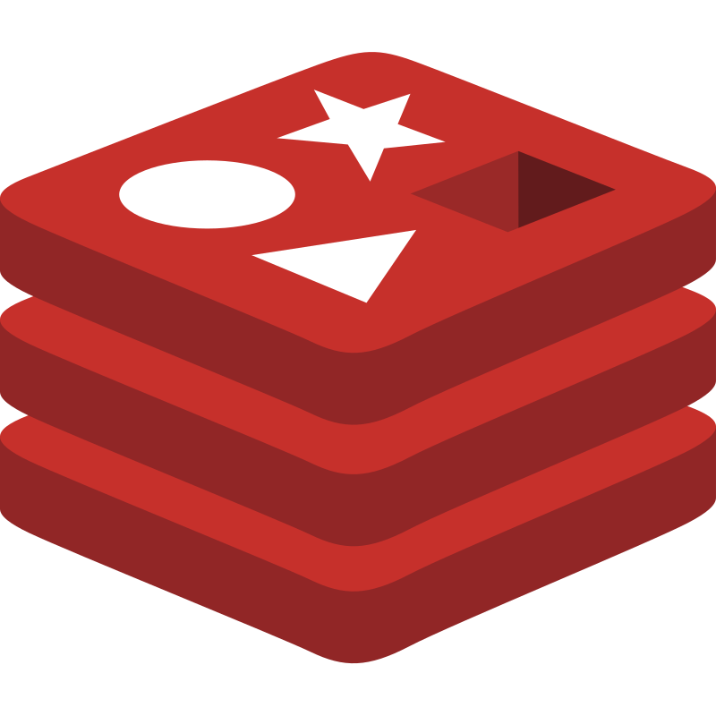

<p align="center">
   <br/>
   <a href="https://authjs.dev" target="_blank"></a>&nbsp;&nbsp;&nbsp;&nbsp;
   <h3 align="center"><b>RedisJSON Adapter</b> - NextAuth.js</h3>
   <p align="center">
   Open Source. Full Stack. Own Your Data.
   </p>
   <p align="center" style="align: center;">
      
      
      
   </p>
</p>

## Overview

This is the RedisJSON adapter for [`next-auth`](https://authjs.dev). This package can only be used in conjunction with the primary `next-auth` and official `redis` packages in conjunction with a Redis server that has the [`RedisJSON`](https://redis.io/docs/stack/json/) module installed. It is not a standalone package.

## Getting Started

1. Install `next-auth` and `@next-auth/redisjson-adapter` as well as `redis` via NPM.

```js
npm install next-auth @next-auth/redisjson-adapter redis
```

2. Add the following code to your `pages/api/[...nextauth].js` next-auth configuration object.

```js
import NextAuth from "next-auth"
import { RedisJSONAdapter } from "@next-auth/redisjson-adapter"
import { createClient } from "redis";

// Pass any required client configuration as arguments per https://github.com/redis/node-redis/blob/master/docs/client-configuration.md
const redis = createClient();

// For more information on each option (and a full list of options) go to
// https://authjs.dev/reference/configuration/auth-options
export default NextAuth({
  ...
  adapter: RedisJSONAdapter(redis)
  ...
})
```

## Specifiying key prefixes

You can change the prefixes by passing an `options` object as the second argument to the adapter factory function.

The default values for this object are:

```js
const defaultOptions = {
  baseKeyPrefix: "",
  accountKeyPrefix: "user:account:",
  accountByUserIdPrefix: "user:account:by-user-id:",
  emailKeyPrefix: "user:email:",
  sessionKeyPrefix: "user:session:",
  sessionByUserIdKeyPrefix: "user:session:by-user-id:",
  userKeyPrefix: "user:",
  verificationTokenKeyPrefix: "user:token:",
}
```

Usually changing the `baseKeyPrefix` should be enough for this scenario, but for more custom setups, you can also change the prefixes of every single key.

Example:

```js
export default NextAuth({
  ...
  adapter: RedisJSONAdapter(redis, {baseKeyPrefix: "app2:"})
  ...
})
```

## Contributing

We're open to all community contributions! If you'd like to contribute in any way, please read our [Contributing Guide](https://github.com/nextauthjs/.github/blob/main/CONTRIBUTING.md).

## License

ISC
